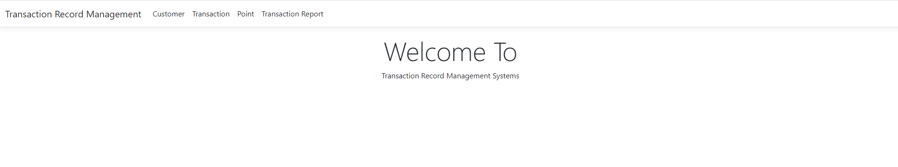
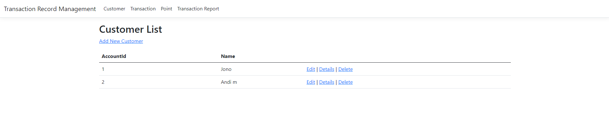
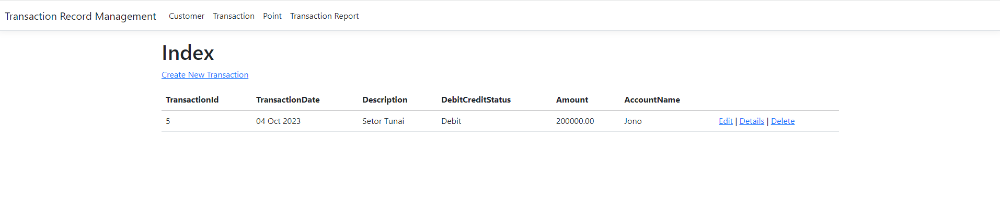
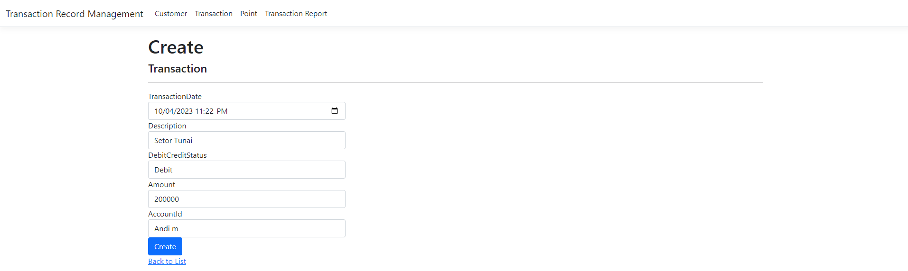

# TransactionRecordManagement
This project is Test Assesment from Tujuh Sembilan company.

## Requirement
1. Install Visual Studio 2022 and .NET Framework 7 
2. Install XAMPP and Running Apache and MySQL
3. Import transactionrecordmanagement.sql to MySQL Database
4. Open this project and running in Visual Studio 2022

## Overview
This is an Overview for this project
### Home Page

### Customer Page

### Transaction Page

### Create Transaction Page

